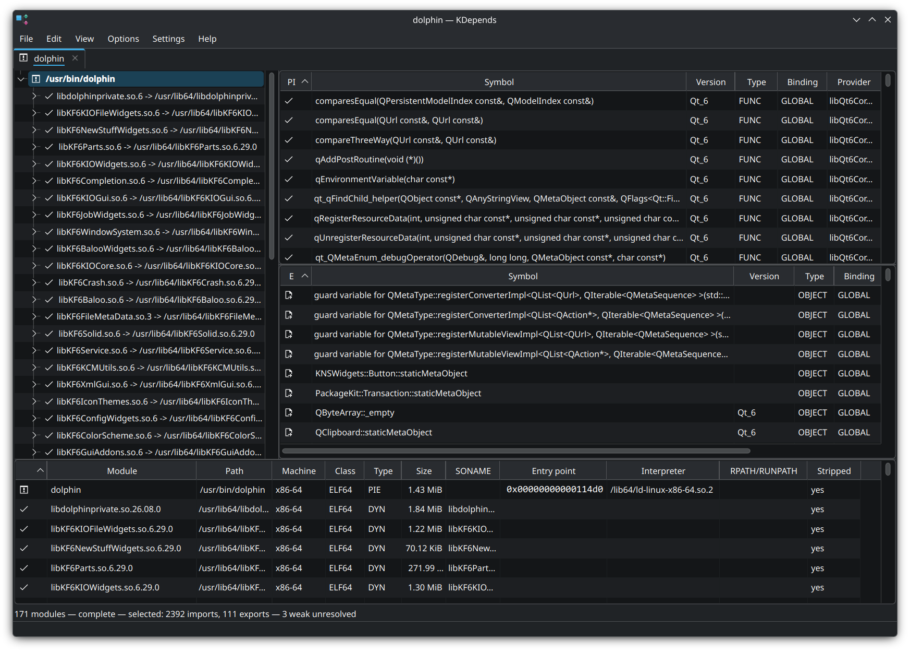

#  KDepends

A native KDE application for inspecting the dynamic dependencies of Linux ELF
binaries — the Linux counterpart to the of the
classic Windows Dependency Walker tool `depends.exe`.

Open an executable or shared library and KDepends shows, in one window:

- the **recursive dependency tree** of the file, resolved the way `ld.so` would
  resolve it on this machine,
- the **imported symbols** of the selected module, each annotated with the module
  that actually provides it,
- the **exported symbols** of the selected module,
- a **flattened table of every unique module** in the closure, with per-module
  metadata.

KDepends is a static inspector. It reads bytes; it never loads, maps, or
executes the file you point it at.



## Features

- **Faithful `ld.so` resolution** — transitive `DT_RPATH` (suppressed by
  `DT_RUNPATH`), `LD_LIBRARY_PATH`, the requester's own `DT_RUNPATH`,
  `/etc/ld.so.cache`, then the default library directories. `$ORIGIN`, `$LIB`,
  and `$PLATFORM` are expanded, and candidates whose ELF class or machine does
  not match the requester are skipped, exactly as the dynamic linker does.
- **Import resolution** — for every undefined symbol, which module in the
  closure supplies it, following the ELF global lookup order breadth-first from
  the root. Unresolved imports are flagged, with the legal weak-unresolved case
  shown distinctly.
- **Symbol versioning** — `GLIBC_2.17`-style version requirements and
  definitions from `.gnu.version`, `.gnu.version_r`, and `.gnu.version_d`.
- **C++ demangling** — Itanium ABI, toggleable at runtime (F10). Non-C++ names
  pass through unchanged.
- **Module metadata** — path, machine, ELF class, type (EXEC/DYN/PIE), file
  size, SONAME, entry point, interpreter, RPATH/RUNPATH, and whether the file is
  stripped.
- **Fully threaded analysis** — every byte of parsing and resolution happens on
  a background thread pool. The window stays interactive no matter how large the
  dependency closure is; panels fill in as results arrive, and the tree expands
  lazily.
- **Tabs** — one tab per opened file, opened via File→Open, the recent-files
  list, the command line, or drag-and-drop onto the window.
- **Live filters** beneath the imports, exports, and modules tables, and
  standard copy/select-all in every table.
- **In-project ELF parsing** — no libelf or ELFIO dependency; every read is
  bounds-checked, so truncated or malformed files produce a clear error rather
  than a crash.

Missing modules and unresolved imports are given distinct icons so broken
closures stand out immediately.

## Building

Requirements:

- a C++20 compiler
- Qt 6.5 or newer (Core, Gui, Widgets)
- KDE Frameworks 6 (CoreAddons, I18n, XmlGui, Config, ConfigWidgets,
  WidgetsAddons, KIO)
- CMake 3.16 or newer and extra-cmake-modules

```sh
cmake -B build -G Ninja -DCMAKE_BUILD_TYPE=Release -DCMAKE_INSTALL_PREFIX=/usr
cmake --build build
sudo cmake --install build
```

On Fedora/openSUSE the dependencies are roughly `qt6-qtbase-devel`,
`kf6-*-devel`, and `extra-cmake-modules`; on Debian/Ubuntu, `qt6-base-dev`,
`libkf6*-dev`, and `extra-cmake-modules`.

## Usage

```sh
kdepends                       # open with no file
kdepends /usr/bin/dolphin      # open one or more files in tabs
```

You can also drag a binary onto the window, or use File→Open.

| Shortcut | Action |
| --- | --- |
| `Ctrl+O` | Open a file |
| `F5` | Re-analyze the current tab |
| `Ctrl+W` | Close the current tab |
| `F10` | Toggle C++ demangling |
| `Ctrl+F` | Focus the filter box |
| `Ctrl+C` / `Ctrl+A` | Copy selection / select all in a table |

Right-clicking an import offers "Go to providing module" and "Look up symbol
online"; right-clicking a module in the tree or the modules table offers copy
path, open in a new tab, and open the containing folder.

Options, the recent-files list, and window geometry persist across sessions via
KConfig.

## Scope

KDepends deliberately does **not** handle: PE/COFF binaries, `dlopen`-time
dependencies or anything else requiring the program to run, big-endian ELF, core
dumps, kernel modules, static archives, disassembly or hex viewing, or
non-C++ demangling.

Resolution reflects *this* machine and KDepends' own environment — like the
original tool, it answers "what would load here, now", not "what would load
anywhere".

## Contributing

Development conventions, architecture notes, and the invariants the code relies
on are documented in [development-guide.md](development-guide.md) and
[coding-style.md](coding-style.md).

## License

MIT — see [LICENSE](LICENSE). KDE Frameworks are LGPL and linked dynamically.
